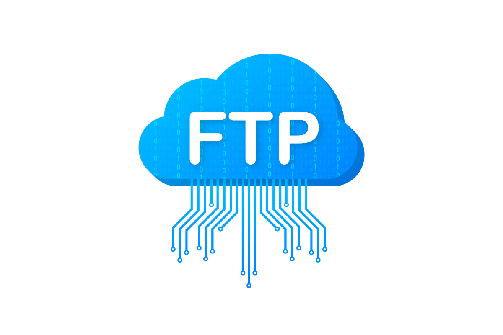

# Gekozen Onderwerp: FTP

## Inhoudsopgave
1. [Wat is FTP?](#wat-is-ftp)
2. [Voordelen en nadelen van FTP](#voordelen-en-nadelen-van-ftp)
3. [Vergelijking met SFTP](#vergelijking-met-sftp)
4. [Welke risico's zijn er bij FTP?](#welke-risicos-zijn-er-bij-ftp)
5. [Ga naar de bronvermelding](#hier-vind-je-ook-nog-de-bronvermelding)

---

### Wat is FTP?
FTP staat voor **File-Transfer-Protocol**. Het is een manier om bestanden te uploaden en downloaden
naar/van servers via het internet.

---

### Voordelen en nadelen van FTP

| **Bron**      | **Informatie**    | **APA-bronvermelding**       |
|---------------|-----------------|---------------------------------------------------------|
| Wikipedia     | Veiligheid                  | Wikipedia. (2025, maart 24). URL. *Wikipedia, de vrije encyclopedie*.  |
| Google Search | URL-vragen                 | Smit, J. (2023, oktober 15). URL-vragen: Wat je moet weten. |

---

### Vergelijking met SFTP
- **FTP**: Geen versleuteling, wat betekent dat alles in platte tekst wordt verzonden.  
- **SFTP (SSH File Transfer Protocol)**: Gebruikt SSH-versleuteling om gegevens veilig te versturen, waardoor dit een veel veiligere optie is.

---
### Welke risico’s zijn er bij FTP?
FTP stuurt gegevens zonder encryptie. Een hacker kan toegang krijgen tot:
- Gebruikersnamen en wachtwoorden.
- Overgedragen bestanden (zoals documenten en afbeeldingen).

---
Als je je nodige informatie niet vond, surf dan naar: [Wikipedia.org](https://nl.wikipedia.org/wiki/File_Transfer_Protocol).

---
#### Hier vind je ook nog de [Bronvermelding](pagina2.md)
